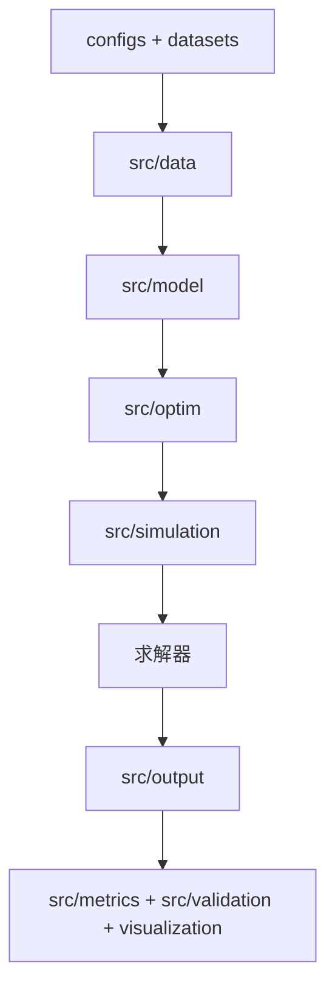

# TanU_HuBei

面向湖北省 2030 年电力系统的时序生产模拟项目。

本项目参考已有的 **TanU** 生产模拟程序，使用湖北 2030 算例资料，逐步建立一套结构清晰、能够协同开发、便于验证和扩展的电力系统生产模拟程序。

当前首要目标不是一次性复刻 TanU 的全部功能，而是先打通以下主链路：

```text
湖北2030原始数据
    -> 数据读取与校验
    -> 电网、分区、机组和场景对象
    -> 生产模拟优化模型
    -> 求解与结果输出
    -> 物理约束和结果合理性校验
```

> [!IMPORTANT]
> `湖北2030` 原始资料包含大量 Excel 数据。未经确认，不得将原始数据、运行结果大文件或敏感信息上传至 GitHub。

## 目录

- [1. 项目目标](#1-项目目标)
- [2. TanU 参考项目介绍](#2-tanu-参考项目介绍)
- [3. 湖北2030资料说明](#3-湖北2030资料说明)
- [4. TanU_HuBei 目标架构](#4-tanu_hubei-目标架构)
- [5. 当前需要完成的任务](#5-当前需要完成的任务)
- [6. 首期实施顺序](#6-首期实施顺序)
- [7. 数据与配置约定](#7-数据与配置约定)
- [8. 快速开始](#8-快速开始)
- [9. GitHub 协作规则](#9-github-协作规则)
- [10. 开发与测试规范](#10-开发与测试规范)
- [11. 首期验收标准](#11-首期验收标准)
- [12. 后续路线图](#12-后续路线图)

## 1. 项目目标

### 1.1 项目要解决的问题

电力系统生产模拟用于回答以下问题：

- 在给定负荷、新能源出力、机组参数和输电约束的情况下，各类电源应如何安排出力？
- 火电机组何时开机、停机，如何满足最小开停机时间和爬坡约束？
- 风电、光伏、水电、储能和抽水蓄能如何参与系统平衡？
- 各分区之间的输电断面和外来电力流是否满足约束？
- 系统是否存在弃风弃光、负荷损失、备用不足或断面越限？
- 不同场景下，系统运行成本和可靠性指标如何变化？

### 1.2 首期目标

首期以 **湖北 2030 年 8760 小时生产模拟** 为核心，完成一条可验证的最小闭环：

1. 建立规范的项目目录和配置方式。
2. 读取湖北算例中的分区、机组、负荷、新能源、流域和输电数据。
3. 将原始表格转换为统一、带明确单位的数据对象。
4. 构建基础生产模拟模型。
5. 先在脱敏小算例和短时间范围上验证，再尝试年度 8760 小时算例。
6. 输出机组出力、分区平衡、新能源消纳、储能状态等结果。
7. 自动检查功率平衡、容量上下限、储能能量边界和断面越限。

### 1.3 首期暂不要求完成

以下能力属于后续扩展方向，不作为首期主链路的前置条件：

- 完整电力市场日前、实时出清功能；
- 基于节点网络的完整 AC 潮流；
- 复杂场景聚类与场景削减算法；
- 分钟级精细化生产模拟；
- 完整的图形界面或 Web 系统；
- 在没有验证依据时承诺固定的求解时间或性能指标。

## 2. TanU 参考项目介绍

### 2.1 TanU 是什么

TanU 是一套面向电力系统生产模拟和机组组合问题的 Python 程序。参考项目中已经包含较多模型、算例和运行脚本，可以帮助我们理解完整生产模拟程序需要哪些组成部分。

参考项目的主要能力包括：

- **SUC**：随机机组组合，决定火电机组启停和各资源出力；
- **SED**：经济调度，在给定或简化启停状态下安排出力；
- **多场景计算**：处理多组负荷、风电和光伏时序；
- **滚动优化**：把较长时间范围拆分为多个窗口求解；
- **两阶段机组组合**：处理不同阶段之间的决策关系；
- **资源聚合**：对火电、储能或流域资源进行聚合；
- **结果输出**：将求解结果整理为表格；
- **单元测试**：验证储能、可再生能源、优化模型等部分逻辑。

### 2.2 TanU 参考项目的运行逻辑

TanU 的典型运行流程可以概括为：


参考项目中，湖北算例配置已经体现了以下基本思路：

- 将湖北划分为鄂东、鄂西、鄂西北等区域；
- 读取火电、水电、储能、抽蓄、风电、光伏和负荷数据；
- 读取分区之间的断面信息和外来直流电力流；
- 读取不同区域的新能源、负荷时序；
- 将水电机组与流域数据关联；
- 使用配置文件指定算例路径、时间范围、求解器和场景数量。

### 2.3 TanU 旧目录的作用

| TanU 旧目录 | 主要内容 | 可以借鉴的部分 | 在新项目中的处理 |
| --- | --- | --- | --- |
| `core/` | Grid、Zone、Thermal、Storage、Scenario 等对象 | 资源属性和对象关系 | 拆分并迁移到 `src/model/` 等目录 |
| `readdata/` | Excel、配置和时序数据读取 | 湖北表格读取逻辑 | 合并为统一的 `src/data/loader.py` |
| `models/` | 优化变量、约束和目标函数 | 各资源建模公式 | 按约束类型拆分到 `src/optim/` |
| `applications/` | SUC、SED、滚动优化、多场景等应用 | 应用组织方式 | 整理为 `src/simulation/` |
| `runcase/` | 各地区和算例的运行脚本 | 运行流程和参数组合 | 保留为简洁运行入口 |
| `tests/` | 模型和约束测试 | 测试思路与案例 | 迁移并扩充到新项目测试 |

### 2.4 为什么不能直接复制旧 TanU

TanU 是重要参考，但旧项目中存在一些不适合继续扩展的问题：

- 数据对象、优化约束和应用逻辑的职责边界不够清晰；
- 不同算例存在多个相似的数据读取文件，后续维护困难；
- 配置项较集中，容易让不相关模块互相依赖；
- 运行脚本较多，部分核心逻辑可能散落在入口脚本中；
- 原始数据、模型代码和结果文件需要更严格地分离；
- 新同学难以快速判断某段代码应该放在哪个模块。

因此，TanU_HuBei 应当**参考 TanU 的模型思想和湖北数据处理经验，同时按照新的分层架构重新组织代码**。

## 3. 湖北2030资料说明

湖北 2030 资料包是本项目的主要算例来源。资料内容较多，使用前需要先完成字段、单位、时间范围和关联关系检查。

### 3.1 数据分类

| 数据类别 | 资料示例 | 主要用途 |
| --- | --- | --- |
| 分区与拓扑 | 分区、断面 | 定义鄂东、鄂西、鄂西北等区域及区域间输电关系 |
| 火电机组 | 火电机组、燃煤机组 | 建立容量、最小出力、成本、启停和爬坡等参数 |
| 水电与流域 | 水电机组、流域对应水电、流域三段式 | 建立水电机组、所属流域以及强迫、预想、平均过程 |
| 储能与抽蓄 | 储能机组、抽蓄电机组 | 建立充放电功率、能量容量、效率和能量状态 |
| 风电与光伏 | 风电装机、光伏装机、各分区时序 | 建立装机容量和可用出力时序 |
| 负荷 | 负荷数据、各分区负荷 | 建立系统和分区负荷曲线 |
| 外来电与断面 | 电力流目录、断面数据 | 建立区域间交换功率和外部直流输入 |
| 多场景数据 | 多场景数据目录、年度场景文件 | 支持不同风光负荷组合和随机生产模拟 |
| 对照结果 | 全网及分区电力平衡表 | 用于结果合理性比对，不应直接作为模型计算结果 |

### 3.2 数据使用原则

所有原始数据在进入优化模型前，都必须经过数据层处理：

1. 确认工作表、表头、字段含义和缺失值。
2. 明确每个数值的单位，例如 MW、MWh、元/MWh、百分比或标幺值。
3. 将时间序列统一到明确的时间索引。
4. 检查机组、分区、流域和断面名称能否正确关联。
5. 检查容量、效率、上下限和概率等参数是否在合理范围内。
6. 将读取结果转换为统一对象，优化层不得直接读取 Excel。

### 3.3 原始数据安全

`datasets/hubei2030/` 只用于团队成员本地保存资料。默认不得提交以下内容：

```text
datasets/hubei2030/**
results/**
*.lp
*.ilp
*.log
```

可以提交到 GitHub 的数据仅包括：

- 不包含敏感信息的脱敏小算例；
- 为测试专门制作的少量样例数据；
- 不包含个人本地路径的配置模板；
- 数据字段说明和使用文档。

## 4. TanU_HuBei 目标架构

### 4.1 架构原则

项目采用“数据读取、对象定义、约束构建、应用调用”分层设计：

- **数据层**只负责读取、清洗、单位换算和校验；
- **对象层**只负责描述电网和资源是什么；
- **优化层**只负责变量、约束和目标函数；
- **应用层**负责组合不同模型并调用求解；
- **运行入口**只负责选择配置并启动应用；
- **输出、指标和验证模块**负责结果落盘、统计和物理检查。



### 4.2 目标目录

以下为项目计划采用的目录结构。目录和模块将随开发逐步建立。

```text
TanU_HuBei/
├── configs/
│   ├── cases/                  # 算例数据位置、文件名和原始单位
│   │   └── hubei2030.yaml
│   └── runs/                   # 时间、建模、求解器和输出设置
│       └── production_base.yaml
├── examples/                   # 可提交的脱敏小算例
├── datasets/
│   └── hubei2030/              # 本地原始资料，不提交到GitHub
├── src/
│   ├── data/                   # 数据读取、单位换算和校验
│   ├── model/                  # 电网与资源数据对象
│   ├── optim/
│   │   ├── constraints/        # 优化约束
│   │   └── objectives/         # 目标函数
│   ├── simulation/             # 生产模拟、机组组合等应用
│   ├── scenario/               # 场景处理
│   ├── metrics/                # 可靠性、经济性等指标
│   ├── validation/             # 物理约束与结果校验
│   ├── visualization/          # 绘图
│   └── output/                 # 结果写入和报告
├── runcase/
│   └── run_hubei_annual.py     # 湖北年度生产模拟入口
├── tests/
├── results/                    # 本地结果，不提交大文件
├── docs/
└── README.md
```

### 4.3 从旧 TanU 到新架构的映射

| 旧 TanU 内容 | TanU_HuBei 目标位置 | 重构要求 |
| --- | --- | --- |
| `readdata/readgriddata*.py` | `src/data/loader.py` | 合并为统一入口，不为每位同学或每个地区复制读取器 |
| `readdata/buildgriddata.py` | `src/data/grid_builder.py` | 负责将规范数据组装为电网对象 |
| `core/thermal.py` 等资源类 | `src/model/thermal_unit.py` 等 | 使用有物理意义和单位后缀的字段 |
| `models/*model.py` 中的约束 | `src/optim/constraints/` | 按火电、储能、水电、平衡等约束拆分 |
| `models/objectivemodel.py` | `src/optim/objectives/cost_min.py` | 首期实现生产成本最小化 |
| `applications/SED.py` | `src/simulation/production_sim.py` | 只负责组装和调用，不直接写约束公式 |
| `applications/SUC.py` | `src/simulation/unit_commitment.py` | 组织机组组合模型 |
| `runcase/runHB8760Case.py` | `runcase/run_hubei_annual.py` | 只读取配置并调用应用层 |
| 结果输出脚本 | `src/output/`、`src/metrics/` | 区分结果写入与指标计算 |

## 5. 当前需要完成的任务

本节列出项目当前的模块方向。每个模块都应通过独立的 `feature/<task-name>` 分支开发，并通过 Pull Request 合并到 `dev`。

### 5.1 项目框架与工程基础

**目标：** 建立团队可以共同遵守的代码、配置、数据和测试目录。

主要工作：

- 按目标架构创建目录和 Python 包；
- 完善 `.gitignore`，排除原始数据、结果、虚拟环境和 IDE 文件；
- 建立依赖说明和统一的 Python 环境；
- 将架构约定、数据说明和协作规范写入文档；
- 建立可运行的最小测试命令。

完成标志：

- 新同学克隆仓库后可以理解目录用途；
- 不会误提交 `.idea/`、虚拟环境、原始数据或大型结果；
- 测试目录和配置目录可以被后续模块直接使用。

### 5.2 湖北数据读取与校验

**目标：** 使用一个统一入口读取湖北 2030 资料，避免为不同文件复制大量读取代码。

主要工作：

- 读取分区、断面和外来电力流；
- 读取火电、水电、储能、抽蓄、风电、光伏和负荷；
- 读取流域三段式数据及流域与水电机组的关联；
- 读取单场景和多场景时序；
- 处理 `.xls`、`.xlsx` 的格式差异；
- 建立缺失值、重复名称、时间长度、单位和参数范围校验；
- 将文件名和原始单位放入 `configs/cases/hubei2030.yaml`。

完成标志：

- 数据读取后能输出结构化摘要；
- 错误数据能够在建模前给出清晰提示；
- 数据层之外的代码不直接读取 Excel；
- 配置中只使用相对路径。

### 5.3 电网与资源对象

**目标：** 用清晰的数据类描述湖北电网中的分区、资源、流域和输电关系。

主要对象：

- `Grid`、`Zone`、`Transmission`；
- `ThermalUnit`、`HydroUnit`、`StorageUnit`；
- `RenewableUnit`、`Load`；
- `Basin`、`Scenario`、`ScenarioSet`。

完成标志：

- 每个资源具有唯一标识和所属分区；
- 字段名称能够体现物理意义和单位，例如 `p_max_mw`、`energy_capacity_mwh`；
- 对象层不读取文件，也不创建优化约束；
- 湖北数据能够被正确组装为一个完整电网对象。

### 5.4 优化变量、约束与目标函数

**目标：** 建立首期生产模拟所需的基础优化模型。

首期优先实现：

- 分区功率平衡；
- 火电出力上下限；
- 火电启停、爬坡和最小开停机时间；
- 风电和光伏可用出力与弃电；
- 水电出力和流域能量约束；
- 储能充放电功率和 SOC 更新；
- 区域间断面功率限制；
- 必要的备用约束；
- 生产成本、弃电惩罚和负荷损失惩罚构成的成本最小化目标。

完成标志：

- 每类约束位于独立模块；
- 约束函数使用规范对象和明确参数，不读取原始数据；
- 核心公式具有手算小案例或单元测试；
- 不可行模型能够输出可定位的问题信息。

### 5.5 生产模拟应用

**目标：** 将数据、对象、约束、目标函数和求解器组成完整运行流程。

首期应用：

- 小时级生产模拟；
- 基础机组组合；
- 湖北年度运行入口；
- 为后续滚动优化和多场景模型预留接口。

完成标志：

- `runcase/run_hubei_annual.py` 只负责加载配置和调用应用；
- 应用层不直接编写资源约束公式；
- 能够选择短时段进行快速调试；
- 模型状态、求解状态和异常信息能够被记录。

### 5.6 结果输出、指标与可视化

**目标：** 让模型结果可以被检查、分析和复现。

建议输出：

- 各类机组逐时出力；
- 火电机组启停状态；
- 风电、光伏可用出力、实际出力和弃电；
- 储能充电、放电和 SOC；
- 分区负荷、发电和交换功率；
- 断面功率与越限情况；
- 系统成本、弃电量、负荷损失量等汇总指标。

完成标志：

- 原始求解结果和汇总指标分开保存；
- 输出文件包含时间、场景、资源和单位信息；
- 输出目录由运行配置指定；
- 大型结果文件默认不提交到 GitHub。

### 5.7 物理校验与自动测试

**目标：** 不仅让模型“成功求解”，还要确认结果符合物理规律和业务常识。

基础校验：

- 每个时段的功率平衡残差；
- 机组出力是否超过上下限；
- 火电爬坡和启停约束是否满足；
- 储能 SOC 是否越界，能量更新是否一致；
- 风光实际出力是否超过可用出力；
- 区域间断面是否越限；
- 汇总结果能否与已有电力平衡资料进行合理对照。

测试顺序：

1. 单个函数和单类约束的手算测试；
2. 脱敏小算例；
3. 湖北短时间范围；
4. 湖北全年 8760 小时算例。

## 6. 首期实施顺序

首期工作建议按以下顺序推进。后一阶段应尽量建立在前一阶段已通过测试的基础上。

| 阶段 | 核心工作 | 阶段交付物 |
| --- | --- | --- |
| 1. 工程框架 | 建立目录、配置、忽略规则和测试入口 | 可协作的项目骨架 |
| 2. 数据摸底 | 梳理湖北文件、字段、单位和关联关系 | 数据字典与校验规则 |
| 3. 数据主链路 | 完成统一读取、校验和 Grid 构建 | 可加载的湖北电网对象 |
| 4. 小模型闭环 | 实现基础平衡、资源约束和成本目标 | 可求解的脱敏小算例 |
| 5. 湖北短周期 | 使用湖北数据运行若干小时或若干天 | 可检查的湖北结果 |
| 6. 湖北年度算例 | 尝试 8760 小时计算，按需要优化性能 | 年度结果与异常记录 |
| 7. 结果验收 | 完成自动校验、汇总指标和对照分析 | 首期验收报告 |

> [!NOTE]
> 年度模型可能对求解器、内存和模型规模有较高要求。应先确保短周期结果正确，再讨论聚合、滚动优化或性能优化。

## 7. 数据与配置约定

### 7.1 本地数据目录

每位同学将获得的湖北资料放到以下位置：

```text
datasets/hubei2030/
```

代码和配置必须使用相对路径，不得写入个人电脑路径，例如：

```text
# 正确
datasets/hubei2030/火电机组.xls

# 错误
D:/某位同学/Desktop/湖北2030/火电机组.xls
```

### 7.2 配置拆分

项目不使用一个包含全部开关的“大配置”。配置按用途拆分：

- `configs/cases/hubei2030.yaml`：数据文件、原始单位和算例信息；
- `configs/runs/production_base.yaml`：时间范围、建模选项、求解器和输出设置。

一次运行由一个算例配置和一个运行配置共同决定：

```text
hubei2030.yaml + production_base.yaml -> run_hubei_annual.py
```

### 7.3 单位约定

- 原始单位只允许在 `src/data/` 中转换；
- 对象层和优化层使用项目统一单位；
- 字段名尽量包含单位后缀，如 `_mw`、`_mwh`、`_yuan_per_mwh`；
- 标幺值必须明确基准容量，不能和绝对量混用；
- 输出报告如需换算单位，应在 `src/output/` 中处理。

## 8. 快速开始

当前仓库仍处于建设阶段。以下命令展示团队约定的工作流程；部分运行命令需要对应模块完成后才可使用。

### 8.1 克隆仓库

```bash
git clone git@github.com:z-liu-ncepu/TanU_HuBei.git
cd TanU_HuBei
```

### 8.2 从 `dev` 创建功能分支

```bash
git switch dev
git pull origin dev
git switch -c feature/readme-and-scaffold
```

其他任务的分支命名示例：

```text
feature/hubei-data-loader
feature/resource-models
feature/storage-constraints
feature/production-simulation
feature/result-validation
```

### 8.3 准备本地数据

```text
TanU_HuBei/
└── datasets/
    └── hubei2030/
        ├── 分区.xls
        ├── 火电机组.xls
        ├── 水电机组.xls
        └── ...
```

请勿执行 `git add datasets/hubei2030/`。

### 8.4 计划中的测试与运行方式

完成对应模块后，统一使用类似以下方式测试和运行：

```bash
# 运行测试
pytest

# 运行湖北年度生产模拟
python runcase/run_hubei_annual.py \
  --case configs/cases/hubei2030.yaml \
  --run configs/runs/production_base.yaml
```

实际依赖、Python 版本和参数格式将在项目框架阶段确定，并在本节持续更新。

## 9. GitHub 协作规则

### 9.1 分支用途

```text
main
 └── dev
      ├── feature/hubei-data-loader
      ├── feature/resource-models
      └── feature/production-simulation
```

| 分支 | 用途 | 规则 |
| --- | --- | --- |
| `main` | 稳定版本 | 不直接开发，只合并已验证的阶段成果 |
| `dev` | 团队集成开发版本 | 功能通过 PR 合并进入，不直接提交 |
| `feature/<task-name>` | 单个具体任务 | 从最新 `dev` 创建，完成后提交 PR |
| `fix/<problem-name>` | 修复明确问题 | 修复完成后提交 PR |
| `docs/<topic>` | 文档更新 | 用于不涉及代码逻辑的文档修改 |

`feature/xxx` 是一条独立开发分支，不是项目中的子文件夹。一个功能分支可以同时修改多个目录中的相关文件。

### 9.2 每次开始开发

```bash
git switch dev
git pull origin dev
git switch feature/your-task
git merge dev
```

### 9.3 提交与推送

```bash
git status
git add <本次任务相关文件>
git commit -m "feat(data): add hubei thermal unit loader"
git push -u origin feature/your-task
```

常用提交类型：

| 类型 | 用途 | 示例 |
| --- | --- | --- |
| `feat` | 新功能 | `feat(data): add hubei thermal unit loader` |
| `fix` | 修复问题 | `fix(storage): correct soc update equation` |
| `test` | 测试 | `test(thermal): add ramp constraint cases` |
| `docs` | 文档 | `docs(readme): describe initial project tasks` |
| `refactor` | 不改变行为的重构 | `refactor(data): unify excel readers` |

### 9.4 Pull Request 要求

功能分支开发完成后，在 GitHub 创建 Pull Request：

```text
base: dev
compare: feature/your-task
```

PR 至少说明：

- 本次修改解决什么问题；
- 修改了哪些模块；
- 如何测试；
- 测试结果是什么；
- 是否涉及配置、数据格式或公共接口变化；
- 希望审核者重点检查什么。

### 9.5 禁止上传的内容

- 未经许可的真实电网原始数据；
- `datasets/hubei2030/` 中的资料；
- 大型求解结果、日志和模型文件；
- Python 虚拟环境、缓存和 IDE 配置；
- 个人账号、密钥和许可证；
- 包含个人本地绝对路径的配置；
- 未经检查、无法解释的 AI 生成代码。

## 10. 开发与测试规范

### 10.1 模块边界

| 模块 | 应该做 | 不应该做 |
| --- | --- | --- |
| `src/data/` | 读文件、单位换算、数据校验 | 写优化约束 |
| `src/model/` | 定义规范数据对象 | 读 Excel、调用求解器 |
| `src/optim/` | 创建变量、约束和目标函数 | 依赖原始文件格式 |
| `src/simulation/` | 组合模型、调用求解 | 重复编写资源公式 |
| `runcase/` | 读取配置、选择应用并运行 | 堆放核心业务逻辑 |
| `src/output/` | 写结果、生成报告 | 改变模型计算结果 |
| `src/validation/` | 检查物理约束和结果 | 静默修改异常数据 |

### 10.2 编码要求

- 函数和类应有清晰职责；
- 变量名应表达物理含义，避免大量使用 `a`、`b`、`x1` 等名称；
- 公共函数应写明输入、输出和单位；
- 不在代码中硬编码数据文件名、求解器参数或本地路径；
- 复杂公式应注明物理含义和参考依据；
- 对输入异常给出明确错误信息，不静默忽略；
- 新增核心约束时必须同时新增测试。

### 10.3 测试要求

每个模块至少考虑以下测试：

- 正常输入能否得到预期结果；
- 缺失字段和错误单位能否被发现；
- 空数据、重复 ID 和越界参数如何处理；
- 约束边界是否满足；
- 小规模手算案例是否一致；
- 修改是否破坏已有功能。

## 11. 首期验收标准

首期“湖北生产模拟主链路完成”至少需要满足以下条件：

### 11.1 数据与对象

- [ ] 能通过配置加载湖北算例数据；
- [ ] 能识别并校验主要输入文件；
- [ ] 能构建包含分区、资源、流域、场景和输电关系的对象；
- [ ] 单位、时间索引和资源关联关系明确；
- [ ] 原始数据未被提交到 GitHub。

### 11.2 模型与运行

- [ ] 能在脱敏小算例上构建并求解生产模拟模型；
- [ ] 能在湖北短时间范围上完成一次端到端运行；
- [ ] 能尝试运行湖北年度 8760 小时算例，并记录运行条件与问题；
- [ ] 运行入口、配置和核心模型职责分离；
- [ ] 求解失败时能够定位基本原因。

### 11.3 输出与验证

- [ ] 能输出各类资源出力和关键状态；
- [ ] 能输出分区平衡、交换功率和主要汇总指标；
- [ ] 能自动检查功率平衡、上下限、SOC 和断面约束；
- [ ] 能对照已有电力平衡资料解释主要差异；
- [ ] 核心数据读取和约束具有自动测试。

### 11.4 协作与文档

- [ ] 功能通过 `feature` 分支和 PR 合并到 `dev`；
- [ ] 关键模块有使用说明和接口说明；
- [ ] 新同学能够依据 README 准备环境、理解任务并开始开发；
- [ ] `main` 保持为稳定版本。

## 12. 后续路线图

首期闭环完成后，再逐步扩展：

1. **多场景生产模拟**：使用多组负荷、风电和光伏时序评估运行风险。
2. **滚动优化**：降低长时间范围模型规模，并处理跨窗口状态。
3. **场景生成与削减**：建立典型场景并减少冗余场景。
4. **市场出清**：增加报价、社会福利目标和市场结果。
5. **潮流校验**：建立网络模型，对典型时段进行潮流或最优潮流验证。
6. **可靠性、经济性和环境指标**：形成标准化结果报告。
7. **可视化与自动报告**：展示负荷、出力、弃电、SOC、断面和成本等结果。

---

本 README 是项目协作与首期实施的共同约定。架构、配置接口或任务范围发生变化时，应通过 Pull Request 同步更新本文档。
