# 成员五技术文档：系统集成、滚动运行、结果导出与后验物理校验

本技术文档详细阐述了湖北2030电力系统优化调度模型中**成员五（系统集成与后验校验）**的设计架构、实现逻辑、物理校验公式以及集成运行指南。

---

## 一、 模块定位与职责划分

成员五作为整个项目的“总装配线”与“物理质检员”，主要负责以下核心职责：
1. **系统集成（Integration）**：读取 `Yaml` 配置文件，组装由成员一（数据加载）、成员二（网络拓扑与资源配置）、成员三（火电运行约束）和成员四（水电与新能源约束）构建的子模块，利用 `pyoptinterface`（以 Gurobi 作为求解器底层）组建完整的优化模型。
2. **滚动时序模拟（Rolling-Horizon UC）**：支持单窗口（如日前 24h UC）和滚动窗口（如全年 8760h 滚动 UC）仿真运行。处理窗口交界处的**火电机组启停状态/持续时间**以及**储能/抽蓄电量（SOC）**的平滑状态过渡。
3. **后验物理校验（Physical Validator）**：对优化求解器输出的结果进行脱离优化模型的独立物理审查，校验包括节点电力平衡、机组出力越限、储能 SOC 递推守恒、跨区潮流限值等在内的多项物理定律，确保仿真结果真实合理。
4. **格式化导出与可视化（Formatter & Plotter）**：输出包含多 Sheet 的规范化 Excel 报表和分类 CSV 文件；绘制系统级电力平衡、火电出力叠图、储能充放电与 SOC、新能源弃电、跨区断面潮流等核心可视化图表。

---

## 二、 滚动运行逻辑与边界状态传递

为了在长周期（如全年）仿真中兼顾计算速度与求解精度，模型引入了**滚动时序决策（Rolling-Horizon）**机制。

### 1. 窗口切分示意图

对于总跨度为 $T_{\text{total}}$ 的调度周期，设置滚动窗口长度为 $W$（如 24 小时），窗口重叠长度为 $O$（如 4 小时）。每个窗口在优化求解后，仅保留前 $W - O$ 小时的决策结果作为最终输出，而重叠段的计算结果仅用于平滑过渡，并在下一窗口中被覆盖重新求解。

```mermaid
gantt
    title 滚动窗口时间划分示意
    dateFormat  X
    axisFormat %s
    section 窗口 1 (0-23h)
    保留段 (0-19h) :active, 0, 20
    重叠段 (20-23h) :crit, 20, 24
    section 窗口 2 (20-43h)
    保留段 (20-39h) :active, 20, 40
    重叠段 (40-43h) :crit, 40, 44
    section 窗口 3 (40-47h)
    保留段 (40-47h) :active, 40, 48
```



### 2. 状态过渡数学描述

在窗口 $k$ 与窗口 $k+1$ 的交界处，需要保证以下物理量状态的连续性：

#### (1) 火电机组启停与出力状态过渡
设机组 $g$ 的决策变量包括开停机状态 $u_{g, t} \in \{0, 1\}$、出力 $p_{g, t}$。窗口 $k$ 的保留截止时刻为 $t_{\text{keep}}$。
* **出力连续性**：窗口 $k+1$ 的初始出力必须等于窗口 $k$ 在 $t_{\text{keep}}$ 时刻的出力：
  $$p_{g, t_{\text{keep}}}^{\text{Window } k+1} = p_{g, t_{\text{keep}}}^{\text{Window } k}$$
* **持续开/停时间连续性**：机组 $g$ 已持续开机/停机的时间 $T_{g, t}^{\text{on}} / T_{g, t}^{\text{off}}$ 必须累加传递。若机组在 $t_{\text{keep}}$ 时处于开机状态（$u_{g, t_{\text{keep}}} = 1$），则其已持续开机时间为：
  $$T_{g, t_{\text{keep}}}^{\text{on}} = T_{g, t_{\text{keep}} - 1}^{\text{on}} + 1$$
  该值将作为窗口 $k+1$ 计算最小开机时间约束（Min Up Time）的初始边界条件。

#### (2) 储能与抽水蓄能 SOC 电量过渡
设储能/抽蓄机组 $s$ 的电量状态（SOC）决策变量为 $E_{s, t}$。
* **电量连续性**：下一窗口的初始电量 $E_{s, t_{\text{keep}}}^{\text{Window } k+1}$ 必须完全继承上一窗口在该时刻的电量值：
  $$E_{s, t_{\text{keep}}}^{\text{Window } k+1} = E_{s, t_{\text{keep}}}^{\text{Window } k}$$
* **电量守恒校验**：储能电量递推关系为：
  $$E_{s, t} = E_{s, t-1} + P_{s, t}^{\text{charge}} \cdot \eta_{s}^{\text{charge}} - \frac{P_{s, t}^{\text{discharge}}}{\eta_{s}^{\text{discharge}}}$$
  其中 $\eta_{s}^{\text{charge}}$ 与 $\eta_{s}^{\text{discharge}}$ 分别为充、放电效率。

---

## 三、 后验物理校验（Physical Validator）规则

后验校验是一个完全**独立于优化模型**的纯 Python 物理定律检查模块。它从导出的 DataFrame 中提取数值，验证系统运行是否违背基本物理规律。

### 1. 分区电力平衡校验（Power Balance Constraint）

对每个分区（Zone）$z$ 的每个小时 $t$，流入电量必须等于流出电量。
$$\sum_{g \in \mathcal{G}_z} p_{g, t}^{\text{thermal}} + \sum_{h \in \mathcal{H}_z} p_{h, t}^{\text{hydro}} + \sum_{r \in \mathcal{R}_z} p_{r, t}^{\text{renewable}} + \sum_{s \in \mathcal{S}_z} p_{s, t}^{\text{discharge}} + P_{z, t}^{\text{DC-injection}} + P_{z, t}^{\text{AC-import}} + P_{z, t}^{\text{shed}} - P_{z, t}^{\text{load}} - \sum_{s \in \mathcal{S}_z} p_{s, t}^{\text{charge}} - P_{z, t}^{\text{AC-export}} = 0$$

* **允许容差**：$10^{-3}$ MW（由于求解器精度限制，小于此值的差值被视为平衡）。
* **校验项定义**：
  * $\mathcal{G}_z, \mathcal{H}_z, \mathcal{R}_z, \mathcal{S}_z$：分别表示分区 $z$ 内的火电、水电、新能源、储能机组集合。
  * $P_{z, t}^{\text{DC-injection}}$：直流外来电在分区 $z$ 的落地点时序注入（例如：金上直流注入鄂东）。
  * $P_{z, t}^{\text{AC-import}} / P_{z, t}^{\text{AC-export}}$：跨区 AC 联络线流入/流出该分区的潮流。
  * $P_{z, t}^{\text{shed}}$：分区 $z$ 的失负荷量（即供电不足惩罚项）。

### 2. 火电机组运行约束校验

* **出力上下限校验**：若机组 $g$ 在 $t$ 时刻开机（$u_{g, t} = 1$），其出力必须在技术范围内：
  $$P_{g}^{\text{min}} - \epsilon \le p_{g, t} \le P_{g}^{\text{max}} + \epsilon$$
  若机组关机（$u_{g, t} = 0$），则其出力必须严格为 $0$：
  $$p_{g, t} = 0$$
* **爬坡越限校验**：相邻时段出力差值不得超过爬坡上下限：
  $$-R_{g}^{\text{down}} - \epsilon \le p_{g, t} - p_{g, t-1} \le R_{g}^{\text{up}} + \epsilon$$
* **启停时间状态校验**：对于开停机决策，如果 $u_{g, t} = 1$ 且 $u_{g, t-1} = 0$（启动），则在此之前的停机持续时间必须大于等于最小停机时间 $T_{g}^{\text{min-off}}$。

### 3. 储能与抽蓄电量校验

* **容量上下限校验**：每个时段的电量必须在容量范围内：
  $$E_{s}^{\text{min}} - \epsilon \le E_{s, t} \le E_{s}^{\text{max}} + \epsilon$$
* **电量递推关系校验**（时序守恒性）：
  $$\left| E_{s, t} - \left( E_{s, t-1} + P_{s, t}^{\text{charge}} \cdot \eta_{s}^{\text{charge}} - \frac{P_{s, t}^{\text{discharge}}}{\eta_{s}^{\text{discharge}}} \right) \right| \le \text{tolerance}$$
  *特别注意*：在第 0 小时，$E_{s, t-1}$ 应取初始状态电量 $E_{0}$。

### 4. 新能源消纳与弃电校验

新能源（风电 PV / 太阳能 WIND）的预测出力 $P_{r, t}^{\text{forecast}}$ 与实际发电出力 $p_{r, t}$、弃电出力 $P_{r, t}^{\text{curtailment}}$ 必须满足严格的守恒关系：
$$p_{r, t} + P_{r, t}^{\text{curtailment}} = P_{r, t}^{\text{forecast}} = \text{Capacity}_r \cdot \text{CapacityFactor}_{r, t}$$
任何超出预测出力的实际出力，或不合逻辑的弃电都会触发校验失败。

### 5. 跨区输电通道潮流校验

对于电网内部的交流联络线（如 鄂西-鄂东），其有功潮流必须在安全限值之内：
$$-S_{l}^{\text{limit}} - \epsilon \le f_{l, t} \le S_{l}^{\text{limit}} + \epsilon$$

---

## 四、 仿真输出数据格式规范（Data Schema）

运行结束后，仿真结果被整理进统一的数据对象 `SimulationResult` 中。

### 1. 结果表格定义

#### (1) 分区电力平衡表 (`zonal_balance`)
| 字段名 | 数据类型 | 说明 |
| :--- | :--- | :--- |
| `zone` | `str` | 分区名称（如 '鄂东', '鄂西', '鄂西北'） |
| `hour` | `int` | 时刻（从 0 开始） |
| `load` | `float` | 分区本地负荷需求（MW） |
| `thermal` | `float` | 分区内火电总发电出力（MW） |
| `hydro` | `float` | 分区内水电总发电出力（MW） |
| `renewable` | `float` | 分区内新能源实际发电总出力（MW） |
| `storage_charge` | `float` | 分区内所有储能总充电功率（MW） |
| `storage_discharge` | `float` | 分区内所有储能总放电功率（MW） |
| `dc_injection` | `float` | 外来直流电落地点注入电力（MW） |
| `line_import` | `float` | 内部交流联络线流入总电力（MW） |
| `line_export` | `float` | 内部交流联络线流出总电力（MW） |
| `curtailment` | `float` | 分区内新能源弃电总功率（MW） |
| `load_shed` | `float` | 分区缺电失负荷功率（MW） |

#### (2) 火电机组运行表 (`thermal_units`)
包含字段：`unit_id`（机组 ID）、`hour`（时刻）、`power`（出力 MW）、`is_on`（开机状态 0/1）、`startup`（启动决策 0/1）、`shutdown`（停机决策 0/1）。

#### (3) 储能/抽蓄表 (`storage_units`)
包含字段：`unit_id`（机组 ID）、`hour`（时刻）、`charge_power`（充电功率 MW）、`discharge_power`（放电功率 MW）、`energy`（储能电量 MWh）、`is_charging`（充电状态 0/1）、`is_discharging`（放电状态 0/1）。

#### (4) 新能源机组表 (`renewable_units`)
包含字段：`unit_id`（机组 ID）、`hour`（时刻）、`forecast_power`（预测发电能力 MW）、`actual_power`（实际接纳发电出力 MW）、`curtailment`（弃电量 MW）。

#### (5) 输电联络线表 (`transmission_lines`)
包含字段：`line_id`（联络线 ID）、`hour`（时刻）、`flow`（交流潮流值 MW，正值代表 fromZone -> toZone，负值相反）。

---

## 五、 集成运行与测试指南

### 1. 配置文件管理

所有的调度仿真基于 YAML 配置文件运行。

#### 运行基础配置 (`configs/runs/production_base.yaml`)
```yaml
case_name: "hubei2030"
simulation:
  mode: "UC"
  start_hour: 0
  end_hour: 23              # 仿真范围（可设为 8759 代表全年）
  step_hours: 1.0
solver:
  name: "gurobi"            # pyoptinterface 后端求解器
  mip_gap: 0.01             # 相对收敛间隔
  time_limit: 300           # 求解时限 (秒)
  log_to_console: false
rolling:
  enable: true              # 启动滚动窗口
  window_hours: 24          # 滚动视窗长度
  overlap_hours: 4          # 重叠段长度
switches:
  enable_reserve: true      # 启动系统备用约束
  enable_transmission: true # 启动安全潮流断面约束
  enable_cascade_hydro: false # 梯级水电开关
  load_shed_penalty: 100000.0 # 失负荷惩罚因子
```

### 2. 命令行启动方式

项目提供了一个通用的命令行入口脚本 [run_hubei_annual.py](file:///c:/Users/阿杰/PycharmProjects/TanU_HuBei_2/runcase/run_hubei_annual.py)：

```powershell
# 设置 PYTHONPATH 并执行仿真
$env:PYTHONPATH="c:\Users\阿杰\PycharmProjects\TanU_HuBei_2"
python runcase/run_hubei_annual.py --case configs/cases/hubei2030.yaml --run configs/runs/production_base.yaml --out output/production_run
```

**运行输出效果**：
脚本将顺序完成各个窗口的 PyOptInterface 建模与优化求解，显示如下日志：
```text
[Simulation] Solving Window 1/1: hours [0 ~ 23] (keeping to 23)
Set parameter LicenseID to value 2832329
Set parameter MIPGap to value 0.01
Set parameter TimeLimit to value 300

[Simulation] Run completed. Running physical validation...
[Simulation] Physical validation passed successfully.

=================== SYSTEM METRICS SUMMARY ===================
  求解状态 (Solver Status): OPTIMAL
  总运行成本 (Total System Cost): 0.00 元
  求解时间 (Solve Time): 0.65 秒
  总负荷电量 (Total Demand): 396,447.88 MWh
  火电总发电量 (Thermal Generation): 0.00 MWh (0.00%)
  水电总发电量 (Hydro Generation): 112,610.15 MWh (28.40%)
  新能源消纳电量 (Renewable Utilized): 283,837.73 MWh (71.60%)
  新能源总弃电量 (Renewable Curtailed): 0.00 MWh (弃风弃光率: 0.00%)
  总系统缺电量 (Load Shedding): 0.00 MWh
==============================================================
[Formatter] Exported CSVs to: output/production_run\csv
[Formatter] Exported Formatted Excel to: output/production_run\simulation_result.xlsx
```

### 3. 测试验证套件

我们编写了完整的集成测试套件 [test_member5_integration.py](file:///c:/Users/阿杰/PycharmProjects/TanU_HuBei_2/test/test_member5_integration.py) 来确保集成逻辑、滚动窗口拼接和后验物理校验模块完全无误。

执行以下命令运行测试：
```powershell
$env:PYTHONPATH="c:\Users\阿杰\PycharmProjects\TanU_HuBei_2"
pytest test/test_member5_integration.py -v
```

测试套件将自动验证：
1. **日前 24h 仿真测试**：验证日前运行是否无误，输出数据结构是否符合规范。
2. **滚动 48h 时序测试**：验证 24 小时窗口配以 4 小时重叠的滚动模拟能否正常运行、状态边界递推是否平滑、以及最终时间合并是否完美。
3. **物理校验鲁棒性测试**：通过人为篡改输出数据（如人为增加 10,000 MW 负荷或者超出机组出力边界），检查 `validate_simulation_result` 能否敏锐地拦截错误并输出校验失败报告。
